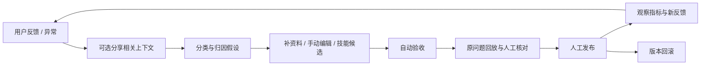

# Visit China AI V6.1：从有据回答到可回放的运营改进

整理日期：2026-09-25。个人产品项目，AI辅助实现。本说明按当前代码与保存的采集、评测记录描述能力；最终工程测试总数、浏览器检查和线上模型验收以最终发布报告为准，暂不填写未汇总的结果。

## 1. 这一版解决什么问题

旅行者想直接解决当前问题：例如浦东机场到上海站的地铁、车站附近餐厅、酒店电话、寄存或支付服务。用户不必先去Source Library手工把资料带入对话。系统先从适用资料中检索，再结合当前问题和上下文调用DeepSeek或固定工具，回答下方显示来源、路线和相关服务卡。

运营需要知道“哪里没解决、依据是什么、改什么、如何验证”。用户的勾叉反馈继续保留；详细反馈可附相关上下文，进入分类、补资料、技能候选、回放和发布流程。工单关闭不替用户改成“已解决”，自动验收通过也不代表线上业务目标达成。

## 2. 把“四种知道”落实为可操作的信息状态

这个框架用来安排下一步动作，不把模型描述成能够穷尽所有未知。每个状态都应能回到来源或观察记录。

| 思考视角 | 产品里的状态 | 记录什么 | 对应动作 |
|---|---|---|---|
| 知道自己知道 | 已核实且适用的资料 | 来源、正文或摘要、地区、核对日期、有效状态、版本 | 自动检索并引用；政策与新闻、地铁与国铁保持边界 |
| 知道自己不知道 | 待补资料或覆盖缺口 | 缺哪个端点、费用条件、正文、当地服务或实时接口 | 定向补问或提示具体缺口；进入资料候选，不用通用追问掩盖未回答 |
| 不易说清但已有的经验与偏好 | 用户已经表达的偏好 | 输出语言、预算、节奏、饮食等明确选择 | 通过选择或澄清变成可修改的偏好；新聊天按用户选择保留，不把推测写成事实 |
| 尚未发现的问题 | 异常与待验证假设 | 未解决、纠正、连接失败、引用冲突、回放失败 | 汇总为排查工单，查看上下文，人工确认问题类型，再转资料或技能候选 |

例如“上海站附近有能吃饭的地方吗”：已核实部分是收录餐厅、地址和物业与站点关系；未知部分可能是当前营业、空桌和步行出口；偏好可以是素食或预算；如果答案把虹桥站餐厅推荐到上海站，就产生路线／位置或意图问题，留待核对并回放。不会把“政府网站有一页”直接当作其中所有事实永久正确。

## 3. 一条回答的实际流程

- 语音和文字进入同一份有版本的会话状态。短噪声输入保持安静；新输入或新聊天不能被旧模型请求覆盖。
- DeepSeek负责语义理解，不负责凭空生成地铁边、出租车运价或订单。缺少端点时问缺失字段，已有明确问题时优先直接回答。
- 资料正文是待引用的数据，不能因文中含有指令就扩大工具权限。
- 引用、数字或输出语言检查不通过时，最多补充生成一次；仍不通过就返回明确错误或资料缺口，不循环生成到“看起来通过”。
- 免费模式可按明确服务提问展示相同的真实记录。它不伪造DeepSeek调用；页面模型连接状态与实际回答来源分开。

### 当前RAG具体是什么

默认按520字符分块，重叠60字符；运营可在受限范围修改。片段带父资料ID、内容版本、序号、字符范围和原链接。检索使用BM25与稀疏TF-IDF余弦，两路通过RRF融合，再按词覆盖、命名实体、资料类型及父文档数量进行确定性重排，默认取前8片段。

这不是学习型embedding、向量数据库或神经网络reranker。重复读到同一父文档的多个片段，也不等于多个独立来源。生产检索每次读取当前资料，批量评测可显式编译固定快照；停用、过期或发布状态变化不能沿用旧生产缓存。

### 证据分与模型自评

**资料证据分大于60**且满足地区、内容、有效期和可用状态时，才能自动进入RAG；**60及以下**进入待核验范围。这个分数来自出处、保存内容、核对时效和状态等检查，不是事实正确概率。

DeepSeek的意图自评分单独展示，未经人工标签校准，不能称作“模型准确率”。低自评可帮助排查；缺少任务端点仍须澄清，即使某条资料分数很高。政府域名是出处依据之一，新抓取的政府摘要仍需核对正文；自动确认摘录要求实际获取的原文匹配，不能仅凭域名通过。

## 4. Graph、Harness和Loop各自负责什么

| 模块 | 当前做法 | 不宣称的能力 |
|---|---|---|
| 站点与地点关系 | 上海418站公开路网快照，线路边、换乘、途经站；真实场所附站点关联依据 | 不读取实时停运、出口可达性、GPS最近距离或当前营业 |
| 执行图 | `retrieve → intent → tool_or_answer → verify → observe`，记录阶段和版本 | 不是无限自主agent，不是已部署LangGraph服务 |
| Harness | 有界检索和表达配置、版本指纹、自动验收、基线与资料版本检查 | 不能执行运营输入的任意代码、增加工具权限或任改运价 |
| Loop | 从反馈提出补资料／技能候选，验收和回放后人工决定发布，可回滚 | 不自动训练DeepSeek权重，不让模型自行发布修复 |

先保留这套轻量结构，不为“用了graph”引入额外数据库。以前的[customer-service-agent](https://github.com/cxy-peter/customer-service-agent)已核对到Neo4j相关实现与说明：例如`neo4j_start.py`、`kg_sub_graph`中的图查询逻辑。这确认历史仓库有Neo4j方案，不代表它目前仍在线；**本站没有部署Neo4j**。复杂跨实体多跳查询成为实际瓶颈后，再用评测比较是否值得引入。

另借鉴[jinshu-fintech-agent](https://github.com/cxy-peter/jinshu-fintech-agent)的来源版本、混合召回与候选隔离，以及现有文枢项目的分块、重排、Harness／Loop设计。未确定归属的历史项目不写成已经交付的政府问答系统；用户实习照片只用于提炼通用流程，不把原图或公司内部接口放进仓库。

## 5. 反馈到发布的运营流程

1. **收集**：勾叉评价按回答ID关联；详细反馈填写期望和问题说明，选择是否附上下文。
2. **定位**：保留意图错误、事实错误、资料过时、路线错误、细节缺失、流程、语言、连接及其他九类。规则和DeepSeek建议都是待核对假设，管理员可改分类。
3. **改进**：事实或时效问题先补／更正来源；流程和表达问题可手动修改有界技能，也可从当前工单生成技能候选。候选不会自动生效。
4. **自动验收**：技能候选首先运行双语检索金标和证据、权限边界检查；这是专门的检索契约验收，不是每次自动运行20,000条真实模型回答。完整回归由Loop评测单独运行。
5. **回放**：在管理员明确授权后，将已分享且脱敏的相关上下文交给DeepSeek，用当前技能或已验收候选重放。保留回答、引用、执行ID、技能和策略版本；检查有回答、有引用或是否触发复核，人工继续核对是否解决了原问题。
6. **发布与关闭**：有界检索技能由管理员显式发布，发布时再次验证配置hash、旧基线和资料版本；可回滚。原有行为策略的独立账号审核规则保留。工单关闭要求处理说明和对应当前上下文的回放记录，但不会改写用户原始勾叉。

当前代码把候选验收、回放和发布做成可操作步骤；**没有把“人工逐条判定本工单已修复”自动推断成程序真值，也没有把每次发布都强制绑定一条工单回放**。表达规则变更应在发布前完成人工回放核对。

管理员直接提交资料时可发布并保留审计／回滚，低证据资料仍受回答准入门槛限制。审核员按实际权限查看材料或参与对应审核，不能冒充管理员签发体验码、操作工单或调用付费回放。登录说明可以列角色与入口，不公开生产密码、API密钥或码的哈希。

## 6. 上下文分享与数据权限

普通勾叉是匿名行为事件，不默认把完整聊天上传给运营。用户在详细反馈中可预览最多8轮相关对话，分享框默认不勾选；提交时才上传勾选内容，尝试脱敏密钥、邮箱和长号码。自动脱敏不是绝对保证，预览仍供用户检查，也可选择不分享。

工单保存问题、当时答案、引用和执行ID，保留最多30天／最近200单，用户可撤回自己的排查记录。运营查看的是用户主动提交的材料，不是任意旅客的全部历史。管理员将这段材料用于DeepSeek总结／回放时还需勾选本次模型授权，会使用API额度。

一般执行观测只保存阶段、耗时、引用、技能版本和用量等信息，不保存完整会话；回放标记为evaluation，不混入线上执行质量指标。上下文改变会使原有摘要、候选关联或回放的有效性重新检查。

## 7. 来源、新闻与真实服务的规模

| 数据 | 本版规模 | 正确解读 |
|---|---:|---|
| 官方网页索引 | 5,000个去重URL | 上海3,011、北京514、全国1,475；包含历史新闻和活动，不全是现行旅行政策 |
| 保留的原正文抓取元数据 | 1,114条 | 原记录逐条保留，不能因曾抓取正文就当作本日全部复核 |
| 新发现且未抓正文链接 | 3,886条 | 明确标记`body_not_fetched`，不填假摘要，不进入事实RAG |
| 本版真实服务资料 | 20条 | 6酒店、5餐饮、9交通便民服务；10条有公开商务电话 |
| 原地点与新增地点合计 | 30个 | 原19处加11家酒店／餐饮；共享来源页按实体ID处理，同一家Marriott去重 |

服务卡按来源明确的站点关系展示，不把上海站和虹桥站混为一处。餐厅可以通过“位于酒店内＋酒店与车站关系”两条证据关联。电话区分酒店总机、订房、餐厅直拨和分机，未实拨。没有距离证据就不给“最近”“步行几分钟”；地图按钮用于继续核对路线。

出租车记录是上车地点和固定运价估算，铁路记录是站场／12306查询指引。房态、空桌、票价、余票、储物柜和充电宝余量需在运营方查询，本项目未接这些实时接口，也没有交易回执。固定充电设施不能冒充某品牌可借充电宝柜。

`Tengopay`作为检索别名帮助召回可能对应的TenPayGo，回答仍说明名称对应关系。产品事实依据可打开的官网和腾讯发布的应用介绍；打不开的微信公告不写成已读正文。新服务宣传不自动证明上海地铁刷闸、所有交通功能或所有商户均可用。详见[来源研究](V6_1_SOURCE_RESEARCH.md)和[地点来源清单](V6_1_VERIFIED_SERVICES.md)。

### 三天刷新不是每次把5,000篇都重新核实

当前部署配置每日触发检查，服务端以`nextDueAt`判断是否满72小时；也支持管理员手动更新并限制频繁重复。一次轮转检查最多30条启用来源，优先最久未检查的，保存获取结果与正文hash。发现正文变更则产生待处理版本并保留旧摘要的核对状态，不能仅凭新hash自动改写事实。

新闻发现读取已核对的官方feed，按旅行、交通、支付和便民主题发现真实链接。每个feed最多20条，保存候选和失败原因；候选必须后续取得正文、核对地区与时间、查冲突，再走资料发布步骤。候选标题不会直接加入回答或覆盖政策。拒绝访问、robots约束和站点失败如实记录，不保证调度到期就一定抓取成功。

可把“发现”和“核验”视作两个职责清晰的任务；目前用受限采集、候选队列和核验流程落实，不宣称运行了任意自主多agent。两篇都转载同一稿件不构成两个独立来源；多一个agent投票也不能代替事实证据。

## 8. DeepSeek入口：API密钥和体验码分开

| 凭据 | 谁使用／保存 | 作用 |
|---|---|---|
| `sk-…` API密钥 | 项目部署者，保存在服务端环境 | 服务端向DeepSeek请求；不能放进访客体验码框 |
| 既有私人访问码 | 获授权体验者 | 建立本站聊天会话；仍受服务端配置和限流约束 |
| `VC-…` 体验码 | Operations管理员签发给体验者 | 设置期限、调用上限和撤销；后台只保存hash，完整码签发时显示一次 |
| Operations管理员会话 | 已登录管理员 | 可使用管理员连接入口，审核员不能使用 |

体验码支持清理空白、BOM和文档格式；`sk-…`输错入口会明确提示“API密钥不是体验码”。无效、过期、撤销、额度耗尽、缺少服务端Key和上游请求错误分别处理。登录成功只是本站授权成功，不等于模型已成功回答；最终需要实际对话验收，不能以`configured: true`代替。

代码具有本次访问控制与错误处理，线上是否已发布、实际模型和版本以最终发布报告为准。不得在README或截图中放真实密码、完整体验码和API密钥。

## 9. 运营指标大表看什么

每项指标显示时间窗口、分子分母、所需事件、缺失状态及解读边界；匿名会话不直接等于独立用户。没有埋点和没有样本分开显示，不填成0%。

| 观察问题 | 主要数据 | 不能直接推导 |
|---|---|---|
| 回答是否有用 | 已解决／有评价回答、评价覆盖、CSAT | 无评价不等于失败；满意也不等于完成订单 |
| 理解与检索是否正确 | 人工标注意图、实际引用、检索有结果率、离线预期来源 | 模型自评或非空片段不能替代准确率标签 |
| 推荐是否被使用 | 同一会话和卡片的曝光→点击，30分钟顺序窗口 | 外跳不等于买票、付款或GMV |
| 服务是否稳定 | 已记录执行失败、完整回答P95、失败原因 | 留存样本不是全站请求分母；完整回答耗时不是首字延迟 |
| 改进是否推进 | 上下文附带率、回放覆盖、工单关闭、处理时长 | 工单关闭不改变用户评价，不自动证明修复有效 |

真实订单、GMV／ROI、实际转人工会话、退出定义与情绪正确标签未接齐的项明确显示“未接入”。产品设想中的解决率40%、满意度80%等是观察目标，不是已取得结果；样本不足不作显著性或因果判断。

## 10. 验收与交付口径

20,000条用例为去重的中英文组合合成／公开资料改写；保留原1,221条ID和历史上下文。覆盖路网、数值、多轮纠正、RAG召回、准入和反馈分类。轮换采样记录已使用ID，同一采样状态下跨轮不重复，失败仍可单独重放。

本版保存的离线报告为20,000／20,000通过，另外保留10条历史基础场景。**这不是20,000次真实模型调用，也不是线上准确率、用户量或转化率。** 模板相关、开发修复已查看固定留出集等限制详见[评测说明](V6_1_EVALUATION.md)。之后衡量泛化还需要新的人工标注真实问法和独立封存集。

工程单测、接口、浏览器和线上模型的最终数量与结果：**待最终发布验收报告汇总**。不能把本说明中的计划、采集目标或局部测试数写成全站已验收结论。

主要代码入口：`library.js`／`rag.js`管理证据；`assistant.js`／`intent-tools.js`编排回答；`harness.js`管理技能；`feedback-cases.js`／`case-actions.js`处理工单；`ops-metrics.js`定义运营口径；`news-discovery.js`／`source-refresh.js`管理更新；`trial-access.js`管理体验码。
