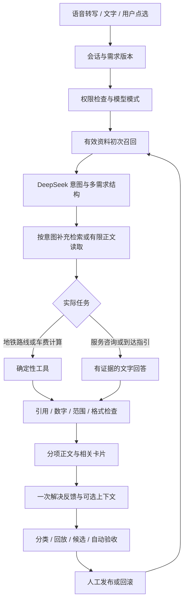

# Visit China AI V6.4：技术与运营交接手册

整理日期：2026-09-25。基于已合并的 V6.4 `main`（`0a1556f`），应用内容与已验收提交 `0c321e7` 一致。本文是代码和验收记录的说明，不把设计目标写成线上成绩。历史版本文档与本文冲突时，以本文对应的 V6.4 实现为准。

## 1. 先理解系统的四个部分

旅行助手接收文字、浏览器语音和主动点选，保留每轮消息与多个需求；Source Library 保存可追溯的资料；DeepSeek 负责语义理解和有证据的表达；Operations 负责查看失败、补资料、调整技能、评测与发布。

模型和应用的分工很具体：模型判断用户在问什么，组织答案；应用检查身份、检索资料、调用路线或车费工具、控制返回格式、记录反馈和决定版本是否可以发布。模型不能因为“觉得可信”就绕过资料状态或权限。

这张图是应用的执行阶段，不是模型内部思考链，也不意味着部署了 LangGraph 或多个常驻 Agent。

## 2. 技术栈与代码导航

| 层 | 当前实现 | 入口 |
|---|---|---|
| 页面与对话 | 静态 HTML、CSS、原生 JavaScript；会话版本与分项结果 | [app.js](../v5/app.js)、[engine.js](../v5/engine.js) |
| 在线语音 | 浏览器识别与语音播报，耐心收音及防回声控制 | [voice.js](../v5/voice.js) |
| 聊天后端 | Node.js、Vercel Functions、服务端 DeepSeek 调用 | [chat.js](../api/chat.js)、[cloud-chat.js](../v5/cloud-chat.js) |
| 意图与回答 | 结构化意图、城市归一、任务分流与工具/模型答案选择 | [model-intent.js](../v5/model-intent.js)、[assistant.js](../v5/assistant.js)、[answer-arbitration.js](../v5/answer-arbitration.js) |
| 检索与知识 | 分块、稀疏召回、融合排序、正文读取与证据状态 | [rag.js](../v5/rag.js)、[library.js](../v5/library.js)、[knowledge-acquisition.js](../v5/knowledge-acquisition.js) |
| 运营与存储 | 运营 API、本地 SQLite、线上私有 Blob 状态 | [ops-api.js](../v5/ops-api.js)、[ops-store.js](../v5/ops-store.js) |
| 技能与评测 | 有界配置、版本、自动验收、全样本 Loop | [harness.js](../v5/harness.js)、[loop-evolution.js](../v5/loop-evolution.js) |
| 反馈与指标 | 用户可选分享的排查上下文、工单和指标口径 | [feedback-cases.js](../v5/feedback-cases.js)、[ops-metrics.js](../v5/ops-metrics.js) |

生产状态使用私有 Vercel Blob，通过 ETag 条件写处理并发冲突，最多重试六次。本地使用 SQLite。它适合当前原型验证；不能据此声称已具备高并发数据库、完整分布式事务或企业级多租户能力。

仓库保留过去探索用的 LiveKit、Vosk 和语音 worker 文件，但 V6.4 面向用户的语音入口是浏览器在线语音。没有部署 Milvus、Neo4j 或学习式向量服务。过往客服项目中确有 Neo4j 代码，复用调查记录在[早期架构说明](V6_HARNESS_RAG_OPERATIONS.md)；代码存在不等于数据库现在仍在线。

## 3. 一次回答如何避免答非所问

### 3.1 先识别服务，再使用地点

“上海火车站周围有充电宝吗”应得到充电服务意图，地点是上海站，不能仅凭“火车站”生成购票卡。若问题是“那里有充电宝吗，以及怎么坐高铁去杭州”，才需要两个独立任务。当前结构最多容纳六个任务；一项失败不应吞掉其他已经完成的回答。

“我从浦东机场落地，要去虹桥火车站，需要注意什么”适合综合到达指引；“请给我地铁换乘图”才明确调用地铁线路展示。已给出的起终点应保留，不能再退回通用的需求询问。

结构化意图也需要规范化。V6.4 实测曾出现模型返回“上海”、知识库使用“Shanghai”，导致资料被城市过滤器排除。修正在入口统一常见城市别名，保留车站端点和未知城市。这是数据契约问题，换一个向量数据库并不能直接解决。

### 3.2 支持资格要拆开判断

银行卡、签证、票种、预约资格等问题采用同一套判断：资料明确公布的能力是什么；个人使用需要满足什么条件；是否存在明确排除；哪些细节没有证据。

例如，购票平台支持某种卡，不等于铁路官方渠道支持；地铁闸机拍卡、手机钱包绑卡和在线购票也不是同一服务。没有提供余额、额度或卡设置，只能说个人交易还需确认，不能反推品牌不支持。AMEX 和 JCB 是回归案例，不是靠品牌名称写死的全部规则。

这些支付事实具有渠道和时间边界。公开演示时应打开当前引用核对，不能把文稿中的历史例子当永久适用的旅行建议。

### 3.3 模型输出不能直接替代事实检查

引用必须能关联有效来源；费用、时间和距离等数字要有依据；输出语言、端点和结构要符合当前请求。V6.4 加入按来源组织的数字清单；数字检查失败时最多进行一次针对性修正，再完整校验。再次失败仍会拦截。

答案选择根据公开规则比较直接回答、引用、端点、行动与长度。可比较时选择或组合工具答案与模型答案；没有候选则显示未参与。它不是独立事实裁判：含有引用不保证推断正确，数字在原文出现也不保证用对对象。

## 4. Source Library 与 RAG 的实际含义

### 4.1 索引、正文、片段是三个层次

当前有 5,000 个去重官方 URL。它们是可查找的入口，不是 5,000 篇已经验证、始终有效的正文。原有 1,114 条保留正文抓取元数据，扩展的 3,886 条主要来自链接发现；正文是否可用要逐条看状态。

可用正文经过分块后，片段保留父资料 ID、版本或内容哈希、字符位置和来源链接。这样可以从一次答案追溯到具体版本，而不是只知道“模型参考过政府网站”。

### 4.2 当前检索方法

默认分块约 520 字符，重叠 60 字符，取前 8 个候选，覆盖阈值 0.06。检索使用 BM25 与稀疏 TF-IDF 余弦分数，经 RRF 融合，再结合词项、证据与父文档分散规则重排。

这里的“稀疏向量”是词项表示，不是神经网络生成的 embedding；“重排”是确定性规则，不是已经接入商业 reranker。现有实现可解释、成本低，但对隐含意图、跨语言同义表达仍有局限。

停用、过期、仅索引和不满足证据条件的资料不能直接参与事实回答。城市、主题和适用范围还会进一步过滤。增加库规模不能代替这些检查。

### 4.3 60 分门槛应怎样理解

V6.4 的入库/引用门槛是证据分 **达到 60**，低于 60 进入待核验；正好 60 不是自动拒绝。这个分数只是流程中的一项条件，不是“有 60% 的正确概率”。无正文、来源冲突、过期、提示注入或活动日期不可信，仍可能被拦下。

模型自评与资料证据分分别展示，不能相互替代。政府域名也不能直接证明提交的文字确实出现在原文，自动确认仍需正文与逐字引文等检查。

### 4.4 新知识与每日活动

模型可用查询去找已有官方索引或每日发现的可信 URL，按域名、robots 等限制读取有限正文；每个回答最多补读一篇。当前不是无边界搜索引擎，模型不能随意访问用户给出的任意 URL。

每日 06:00 UTC，即上海 14:00，检查官方活动和新消息列表，每轮最多评估两篇新正文。原有精选资料按 72 小时门槛轮转复核，也可手动更新。更新有数量、冷却和执行锁限制；调度已配置不等于未来每次抓取都成功。活动按上海日期隐藏过期条目。

社区经验保存平台、日期与来源类别，只补充操作感受，不建立政策、价格或库存事实。本轮参考了公开 Reddit 讨论，没有宣称抓取 X 或小红书的登录内容，也不能把转载视为独立交叉证据。

## 5. 模型、身份和语音的边界

### 5.1 三种凭据各做一件事

| 类型 | 作用 | 正确处理 |
|---|---|---|
| DeepSeek API Key | 服务端调用模型 | 仅配置服务端环境；不能当网站体验码输入 |
| 网站体验码 | 允许访客使用站点额度 | 管理员生成，可设置期限、上限和撤销；服务端保存哈希 |
| Operations 管理员会话 | 运营管理和管理员模型入口 | 通过服务端角色及签名会话校验；审核员没有全部管理员权限 |

管理员登录成功、接口显示已配置和真实模型回答成功是不同检查。排查 `ACCESS_CODE_INVALID` 时应先确定输入的是哪种凭据，再分别查看过期、额度、服务器密钥与模型返回，不让用户反复粘贴 API Key。

密码采用带盐哈希，生产 Cookie 使用 HttpOnly、Secure、SameSite 策略。限流的一部分依赖工作进程内存，不能宣传为全局分布式防刷系统。公共文档只解释角色，不刊登账号密码、真实体验码或 Cookie。

### 5.2 Auto、Flash、Pro

用户可以手动选择；Auto 当前依据主题行程、比较、条件、纠正、多需求及文本长度等有界复杂度规则路由。它不是模型已经学会可靠评估所有题目难度。

项目代码将模式映射到当前配置的 DeepSeek 模型名，见[model-routing.js](../v5/model-routing.js)。这是项目快照，不是对外部厂商永久型号、价格或可用性的承诺。一次回答可能包含意图、正文评估、生成和修正等多次调用，不能以单次生成耗时推算完整体验。

### 5.3 更耐心的语音与补充输入

默认静音等待约 3.2 秒，允许范围 1.5—5 秒，未说完的连接语会延长等待。识别器中途结束时尽量保留草稿并续听；无效短片段不直接触发答案。浏览器支持与权限差异仍会影响效果。

为避免麦克风把助手自己的播报当用户输入，播报时暂停识别，结束后自动恢复；当前支持点按打断，尚不具备可靠的自动语音打断或全双工。等待回答时新增内容会排队进入后续请求，不是插入正在运行的模型内部思考。

语音回归使用模拟识别事件。没有据此声称真实麦克风识别准确率、嘈杂环境效果或端到端延迟已经达标。

## 6. 真实服务、历史数据和平台入口

地铁使用有日期的公开网络快照和站点关系，能生成双语线路图；它不是实时停运、客流或末班车接口。高铁使用标明 2024-06-15 的历史车次记录，支持席别、价格和时段比较，未知字段留空，上海站与上海虹桥站不能互换。

有出处的公开地点/服务记录共 20 条：6 家酒店、5 家餐饮、9 条交通便民服务，包含 10 个公开商务电话。电话来自公开页面，未逐一拨打；不能承诺商户仍营业、当前有房或附近柜机还有充电宝。

16 个上海区的基础路线与历史主题路线提供可查看、可导出的行程起点，不等于任意复杂路线都经过实地验证。对酒店、餐饮、充电等的关联以已知地点和查询入口为基础，不冒充用户实时 GPS 或精确步行导航。

Trip.com、大众点评等产品卡用于提供相关查询入口，产品示例和历史记录有标记。点击平台不是订单、支付或佣金收入。要形成商业转化指标，还需要供应商库存和订单回调。

## 7. 运营权限与发布治理

| 改动对象 | 当前流程 | 不应混淆 |
|---|---|---|
| 管理员提交资料 | 核对后直接发布，保留操作记录和回滚 | 免第二人审核不等于绕过正文、范围和有效性检查 |
| 非管理员资料及待核验来源 | 按来源审核与证据规则处理 | 不能把所有来源都说成已由五人确认 |
| 有界检索技能 | 保存候选 → 自动验收 → 管理员发布 → 可回滚 | 只能改允许字段，不能借配置执行任意代码 |
| 原有行为工作流/提示策略 | 保留五个不同审核账号对当前版本的同意要求 | 账号规则不等于已有五名真实员工；也不是所有编辑都要五票 |
| Loop 候选 | 新批次评测＋历史回归＋版本核对 → 人工选择发布 | 通过评测不等于已上线，更不等于更新模型权重 |

检索技能的可调范围包括 topK 3—12、分块长度 240—900、重叠 0—120、覆盖阈值 0.02—0.4，以及有限长度的扩展词和表达要求。权限是为了让运营做可验收的小改动，而不是开放任意系统提示和工具访问。

Loop 会记录资料、基线配置和评测程序指纹。评测期间或发布前这些内容改变，旧结论就不能直接覆盖新版本。当前一轮 12,000 条产生了候选，发布状态仍是未激活；文稿不会代替管理员执行发布。

## 8. 一次未解决反馈应该怎样处理

用户只评价一次“有帮助·已解决 / 还没解决”。未解决可以选择原因并自愿预览、附上最多八轮相关脱敏上下文。不能因为要排查，就默认上传全部私人对话。

运营按以下顺序处理：

1. 还原用户最后的问题、相关上下文与期望结果，确认反馈指向哪次回答。
2. 查看执行记录：识别意图、命中片段、资料版本、工具、耗时和错误阶段。
3. 标记主要问题：意图错误、事实错误、资料过时、路线错误、缺少细节、流程问题、语言问题、连接问题或其他。
4. 选择最小改动：补资料、修适用范围、改检索技能、修数据规范化或修交互。先不要同时修改多个因素。
5. 用原问法和新的同类/边界问法回放。涉及模型的总结或回放通过明确操作发起，会产生调用成本。
6. 自动检查通过后，人工核对真实回答；重要策略按对应发布流程执行，必要时回滚。
7. 工单关闭要有处理说明与匹配当前内容的回放记录；关闭工单不修改原用户的“未解决”评价。

排查工单保存近 30 天、最多 200 单，执行元数据保存近 30 天、最多 500 条。工单脱敏是规则处理，分享前仍应预览；它不保证去除所有个人信息。标准执行元数据不保存完整聊天和原始录音；用户主动提交的排查材料是另一条有明确同意的路径。

## 9. 运营大表：看什么、如何算、缺什么

下表的“目标”只是参考阈值，不是已达到的成绩。匿名会话也不是独立用户。真实数据与演示数据分开，验收调用应标记为 evaluation，不混入真实经营数据。

| 指标 | 当前分子/分母或统计方法 | 需要的回传信息 | 解读边界 |
|---|---|---|---|
| 用户确认解决率 | 最新评价已解决的回答 / 有评价的回答 | 回答展示、回答ID、会话、结果 | 无评价不是失败；不是整趟旅行完成率 |
| 反馈覆盖率 | 能匹配展示的已评价回答 / 已展示回答 | 展示事件与评价事件关联 | 覆盖低时，解决率有明显选择偏差 |
| 人工标注意图准确率 | 人工确认正确的执行 / 已标注执行 | 原问题、意图、executionId、审核标签 | 模型自评分不能当真值 |
| 检索有结果率 | 有命中片段的执行 / 执行 | hits、dataset、时间 | 非空不等于正确；线上正确命中率仍需独立标签 |
| 猜你想问 CTR | 曝光后匹配点击的会话卡片 / 曝光会话卡片 | suggestion_view/click、session、item、时间 | 至少50%可见；30分钟内匹配并去重 |
| 推荐到平台入口 | 按顺序看到推荐且点击的会话 / 看到推荐的会话 | chat_started → user_message → offer_view → product_click | 同一会话30分钟窗口；终点只是平台外跳 |
| 各类推荐卡 CTR | 对应类别发生匹配点击的会话卡片 / 已曝光会话卡片 | kind、item、session、曝光/点击时间 | 火车、酒店、出租车等分开看，不当购买率 |
| 完整回答耗时 P95 | 已记录服务端完整处理耗时的95分位 | executionId、stages.ms、totalMs | 不是首字延迟，也不覆盖所有网络等待 |
| 已留存执行失败率 | 留存失败 /（留存失败＋记录成功） | errorCode、stage、dataset、执行记录 | 两类记录均有保留上限，不是全站请求失败率 |
| 上下文附带率 | 自愿附上下文的工单 / 工单 | shareContext、脱敏轮数 | 不应为了提高该指标强迫分享 |
| 回放覆盖与关闭率 | 已回放或已关闭工单 / 工单 | caseId、内容指纹、版本、处理记录 | 有回放不等于修复有效；关闭不等于用户满意 |
| 平均处理时长 | 已关闭工单的最后更新时间减创建时间，再取均值 | createdAt、updatedAt、状态 | 当前近似实现，不是客服首次响应时长 |
| 历史独立 CSAT | 旧版独立赞 /（赞＋踩） | 历史满意度事件 | 新版不再独立询问，不能用解决率替代 |
| 转人工、掉线、情绪准确率 | 尚未形成可靠完整指标 | 人工接入回执、结束原因、独立情绪标签 | 提交工单不等于接通客服，离开页面不等于失败 |
| 订单、GMV、ROI、留存 | 尚不具备相应完整业务证据 | 订单/退款回调、成本、稳定用户身份等 | 不拿外跳或合成数据填充 |

异常变红需要同时满足：指标有数值、有参考阈值、有效样本至少 30，并且越过阈值。例如解决率低于 40%、完整回答 P95 高于 60 秒、留存执行失败率高于 5%。意图、非空检索、建议点击的参考目标由对应指标配置提供。30 个样本只是展示门槛，不代表统计显著或因果成立。

## 10. 运营日常与实验设计

建议的每日操作是先看连接失败与超时，再看未解决问题和过期资料，最后看推荐漏斗。点击率再高，如果问题没回答好，不能证明产品有效。每日活动更新任务需要观察成功/失败记录，不能因为配置过一次就长期忽略。

每周可按问题类别抽查：哪些是资料缺失，哪些是有资料但应用判断错误；哪些问题适合修改技能，哪些需要工程修复。复盘输出应是一条可验证假设，例如“将充电服务查询与车站地点拆分后，充电问法不再创建铁路任务”，而不是“提升智能程度”。

如要开展 A/B 测试，应先明确分组单位、主指标、护栏、观察窗口和所需样本，再固定分组。主指标可选带覆盖率解释的解决反馈；护栏包括错误引用、延迟与调用成本。当前系统没有完成可证明线上提升的随机对照实验，不应把离线回放当 A/B 结果。

## 11. 验收怎么做，结果怎么读

V6.4 已保存 372 项程序/接口检查与 221 项浏览器回归。浏览器检查含受控模型和模拟语音；正式站另有 27 项检查、四组实际 DeepSeek 问题，以及管理员只读和双语到达指引补验。四组正式站完整回答约为 25.7、54.3、26.1、32.6 秒，它们只是少量实测，不能据此报告稳定 P95 或“首字三秒”。

离线评测分三层：旧 20,000 条回归保护已有行为；新增 5,000 条、50 主题问法检查资料召回；新一轮 12,000 条用于比较技能候选和基线。5,000 条目标资料召回 4,485 条，即 89.7%；12,000 条基线 11,482，候选 11,657，改善 175、退化 0，仍有 343 条未命中。

这些是合成与公开资料改写的问法，不是用户规模，也不是同样数量的付费模型调用。新5,000条中的4,000开发/1,000家族留出用于本次评测；查看结果后，下一轮还应建立新的封存样本。不同文本仍可能共享模板，不能声称统计独立。

本地复现工程检查使用 `npm test`、`npm run build`；离线语料命令与组成见[评测说明](V6_1_EVALUATION.md)。真实模型验收需要私有配置，并涉及实际费用，应单独记录模型、时间、来源版本与失败。普通工程测试不能证明当前账号余额、真人语音或供应商库存。

## 12. 交接时必须保留的材料

每次发布应保留用户问题、修改假设、代码/技能/资料版本、样本构成、失败明细、验收记录与回滚入口。不能只保留一个“全部通过”的数字。

当前文档没有声称完成实时订房、订票、下单、支付、全双工、学习式 embedding、神经重排、模型微调、真实用户增长或商业 ROI。后续引入这些能力时，应先定义可验证的收益和成本，再增加架构。

## 证据入口

- [V6.4发布说明](V6_4_RELEASE.md)、[最终验收汇总](../evidence/v6.4/final-acceptance-summary.json)。
- [5,000条评测报告](../evidence/v6.4/community-evaluation.json)、[12,000条Loop报告](../evidence/v6.4/loop-evolution.json)。
- [城市字段失败记录](../evidence/v6.4/city-alias-initial.json)、[首次正式站验收问题](../evidence/v6.4/production-initial.json)、[模型复验](../evidence/v6.4/model-retest.json)。
- [运营指标实现](../v5/ops-metrics.js)、[技能实现](../v5/harness.js)、[定时配置](../vercel.json)。
- [公开地点及电话来源](V6_1_VERIFIED_SERVICES.md)、[官方索引及新闻来源](V6_1_SOURCE_RESEARCH.md)。
