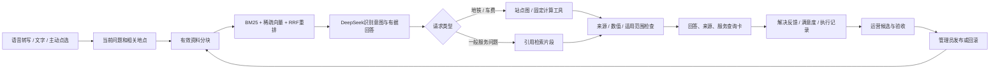

# V6：有依据的旅行问答与可操作的运营闭环

本次沿用现有语音、对话状态、地图、车费工具及审核补丁，增量改造检索和运营层。用户提供的实习照片仅用于提炼通用产品流程，原图、公司内部接口及账号不进入本仓库。

## 架构选择

| 问题 | 本次决定 | 理由与边界 |
|---|---|---|
| 要不要 Harness？ | 加入有界技能配置、自动验收、版本发布与回滚 | 运营可以改检索数量、分块大小、重叠、覆盖阈值、扩展词和表达要求。不能通过输入配置执行代码或扩大工具权限。 |
| 要不要 Graph？ | 保留站点关系图，增加固定执行流程图 | 路线有明确拓扑，回答也有固定阶段。当前规模无需额外维护 Neo4j 服务；有复杂商户、服务、实体多跳问题后再评估。 |
| 是否另建 Loop？ | 扩展现有 Loop | 未解决反馈 → 有界候选 → 检索验收 → 管理员发布 → 真实执行观测 → 回滚。原有需要独立审核的行为策略仍保留。 |
| 是否自进化？ | 生成候选，不自动改模型权重 | “从未解决反馈生成候选”是确定规则；现有 DeepSeek 策略建议需要单次授权，不能自动发布。 |
| 是否向量 RAG？ | 自动 RAG 已接入；当前是稀疏检索 | BM25 + 稀疏 TF-IDF 余弦 + RRF + 文档类型及父文档重排。没有冒充 learned embeddings、BGE 或向量数据库。 |

### 已确认的复用依据

- [customer-service-agent](https://github.com/cxy-peter/customer-service-agent)：`neo4j_start.py` 使用 Neo4j 驱动；`llm_backend/app/lg_agent/kg_sub_graph/agentic_rag_agents/agent.py` 包含 Neo4jGraph、GraphDatabase 和 Neo4jVectorSearchCypherExampleRetriever。确认的是代码存在，不代表该项目当前部署的数据库仍在运行。
- [jinshu-fintech-agent](https://github.com/cxy-peter/jinshu-fintech-agent)：检索模块包含 BM25、混合召回、RRF 和可选重排路径，Harness/Loop 有固定编排与技能扩展设计。
- 用户提供的文枢项目压缩包：读取 Harness、chunker、reranker、Loop 文档，借鉴“记忆不能替代事实来源”“知识片段关联活动版本”“候选先评测再发布”。没有直接运行压缩包中的程序。
- [LangGraph 官方工作流说明](https://docs.langchain.com/oss/python/langgraph/workflows-agents)：用于区分固定工作流与动态 agent。本站采用普通 JavaScript 固定编排，没有宣称已安装 LangGraph。
- [DeepSeek API 文档](https://api-docs.deepseek.com/api/create-response/)：模型负责语义意图和有据回答；应用负责记录、检索、校验、权限及费用边界。
- [Bounce](https://zh.bounce.com/)：借鉴地点查询与服务卡片形式，没有声明 Bounce 上海网点合作或实时库存接入。

## 当前实际回答流程

模型按“服务需求优先、地点修饰其次”识别意图，明确传入当前问题，并在非思考模式使用 temperature=0 降低波动；这不保证每次意图都正确。参数依据：[DeepSeek 官方接口](https://api-docs.deepseek.com/api/create-chat-completion/)。

普通服务问答必须遵循当前输出语言；模型只返回意图、跟随资料使用了错误语言或未通过引用/数字检查时，最多补充生成一次，仍不符合则提示重试，不把错误语言答案直接展示。行首步骤编号不作为事实数字；票价、距离、营业时间等数字继续检查。新增服务意图也保留在跨轮上下文中。

资料不需要先手动加入对话。手动选择依然可用，但同样受城市、暂停与过期检查约束。普通地铁问法优先召回指引；只有明确提到站名时，站点片段才获得更高优先级，避免数百个站点挤掉购票指引。

每个片段保存父资料 ID、内容版本、序号、字符起止和原始链接。后台可提交最多 16,000 字的已核对正文。正文仍是待引用的数据，不能执行其内部指令；政府摘录自动确认也会核对新增正文，不能只靠政府域名直接通过。

## 连接 DeepSeek

生产验证曾确认交付的私人体验码仍能登录。V6 增加空白/BOM处理、TXT/JSON体验码文档导入，以及已登录 Operations 管理员连接入口。管理员连接仍检查服务端签名会话及角色，审核员不能使用这个快捷入口。真实 API 密钥始终留在服务端。

体验码错误、会话过期、服务端密钥错误及余额不足分别提示。断开会话和新聊天继续撤销相应状态；新回答不会覆盖较新的输入。

## 服务来源与显示边界

截至 2026-09-25 已核对并加入资料库：

- [上海地铁乘车与购票指南](https://english.shanghai.gov.cn/en-Individuals-Transportation-PublicTransport/20260813/f257d5c373db4da3a8bde717b9f46b27.html)：乘车码与单程票操作。
- [上海共享充电宝指南](https://english.shanghai.gov.cn/en-MobileAndInternet/20260727/56b62a3a9d2f4ddaa8d77367c206b2ae.html)：租借与归还说明；地图搜索是查询入口，不是已确认的柜机定位或余量。
- [上海行李寄存指南](https://english.shanghai.gov.cn/en-Individuals-Tourism-TouristServices/20260916/719ada5276444dfdb0d4f342ff68da26.html)：地铁、公园及商圈寄存查询。
- [Marriott 酒店官网](https://www.marriott.com/en-us/hotels/shamc-shanghai-marriott-marquis-city-centre/overview/)：上海雅居乐万豪侯爵酒店，西藏中路555号，是人民广场附近的真实酒店示例。不把它称为任意地点附近最近的酒店，不提供假房价或房态。

既有 12306 与平台入口继续可用。侧边“找附近服务”按地点和类别筛选，不读取 GPS，也不会自动把预设对话塞进聊天。示例按钮只填入可编辑输入框。已有机票、火车票演示卡仍标注模拟，平台点击不是下单。

## Operations 的操作顺序

1. 数据概览：先看用户确认解决、评价覆盖、待复核执行和完整回答耗时，再看点击漏斗。
2. 资料库：管理员核对后提交摘要/正文、查看来源、查看变更及回滚。
3. 检索与执行图：输入真实问法，查看命中片段、来源版本、BM25和重排分数；检查最近真实执行使用的技能版本。
4. 技能与自动验收：改配置并保存，自动运行双语检索金标与过期/暂停/跨城等边界检查。通过后才出现发布入口，发布时再次检查资料版本；可以回滚。
5. Loop 与评测：继续运行既有 1,231 条回归（1,221 条语料加10条历史场景），查看来源构成和失败样例；这些不是1,231次真实模型调用。

自动验收的边界是离线检索和工程契约，不是生产业务效果。表达要求变化还需要真实模型小样本与人工回放。没有把模型自评当成概率校准结果。

## 数据回传与指标口径

| 指标 | 回传/依据 | 计算及限制 |
|---|---|---|
| 问题解决率 | `resolution`：匿名会话、回答ID、结果、问题类型 | 已解决 / 已评价。必须同时看评价覆盖；无反馈不算失败。 |
| CSAT | `csat_up/down`：匿名会话＋回答ID | 每个回答最后一次评价有效；赞 /（赞＋踩），独立于解决结果。 |
| 猜你想问CTR | `suggestion_view/click`：会话、推荐ID、时间 | 可见50%才曝光；同一推荐曝光后30分钟内点击，按会话＋推荐去重。 |
| 平台CTR/漏斗 | `offer_view/product_click` 与已有会话事件 | 推荐卡曝光→同卡点击；不能据此推断购票、支付或GMV。 |
| 检索有结果率 | 服务端 `execution.retrieval.hits` | 非空召回 / 执行数，不等于召回正确率。Recall@K来自另行标注的离线检索题。 |
| 意图准确率 | 管理员基于外部回放的对/错标签 | 正确 / 已标注；没有人工真值时显示空值。模型自评不参与。 |
| 延迟 | 服务端本轮开始至回答完成的 `totalMs` | 显示 P95 助手处理耗时，包含检索与模型调用，不含网络往返与存储读写；不是首字延迟。 |
| 人工处理 | 低证据/未解决的复核队列 | 这是运营复核，不代表已连接人工客服或已创建第三方工单。 |
| 掉线、留存、情绪准确率、GMV | 当前缺少可靠事件/标注/订单回调 | 暂不伪造指标。退出页面不能直接算服务失败，情绪需要独立标注。 |

照片里的 95%/85%/80%/20%和3秒只作为初始参考目标，不能写成已达成效果。前四个比例至少30条样本才显示目标状态；该门槛也不等于统计显著性检验。

服务端执行保存最近30天、最多500条，包含阶段、片段ID、来源版本、技能版本和使用量，不保存完整对话、原始录音或模型答案全文。经管理员明确标注的验收调用使用 evaluation 数据标记，不混入新的真实执行指标。匿名浏览器事件仍可能缺失或被伪造，小规模项目指标不能当作严格实验因果结论。

## “四种知道”适合怎么用

它适合放在需求发现与运营复盘中，不适合让用户每轮都走四个问题。落成四种待办即可：已核对事实、已知知识缺口、待确认偏好、探索假设。最后一类靠新场景回放、人工抽检和异常聚类逐步发现，不能保证“未知的未知”已被找全。

每条改动仍用更具体的判断链：用户问题 → 已有证据 → 缺失信息 → 最小改动 → 验收条件 → 观察结果。扩展架构需要解决一个已观察到的问题，而不是只添加术语。

## 验证入口

`npm test`、`npm run build`；浏览器验收见 `v5/harness_browser_test.py` 与现有6套回归脚本。当前证据目录为 `evidence/v6/`。真实 DeepSeek 小样本、公共站点状态与最终发布提交单独记录，不能用 HTTP fixture 代替真实模型验证。

## 本次发布验收

正式网址已发布 V6，代码提交 `b5698a51cf0d1ec0e27fcff63498265a90d82762`。242 项程序/接口测试、163 项本地浏览器检查、18 项合成语音检查、21 项检索契约和 1,231 条确定性场景通过。最终候选另测 10 个真实 DeepSeek 问题；正式网址再测 1 个指定语言问题和 3 轮真实页面对话。共有 31 项公网页面/对话检查通过。

真实调用曾暴露空答案、语言不一致、数字校验和附近服务误判，已修复并保留回归及失败经过。最终小样本通过不代表生产准确率已达标。完整结果见 `evidence/v6/release-verification.json`。
